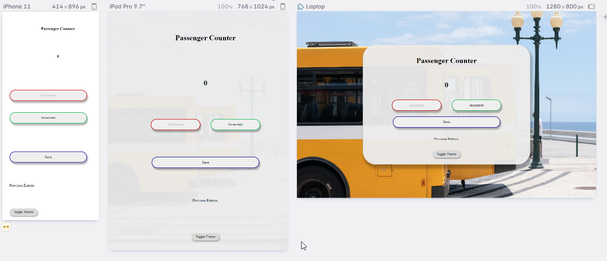
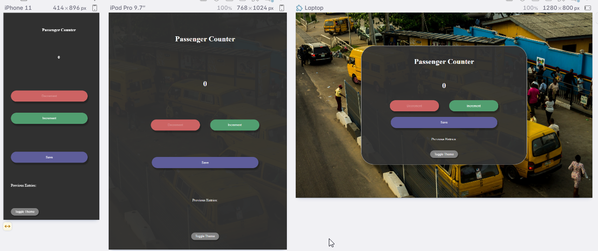

# Passenger Counter App

## Info
- **URL**
    - Repo: https://github.com/m6code/passenger-counter-web2acx
    - Domain: https://passenger-counter-web2acx.vercel.app/
## Features
- Theme Dark/Light + Change Theme Button
- Accessibility + Responsiveness (Mobile and Desktop)
- Custom Fonts
- PWA

## TODOs

- [x] Design & HIFI UI [Light & Dark]
- [x] Implement Hifi UI [Light]
    - [x] Design HTML General Structure
- [x] Implement App JS Logic
- [x] Implement Hifi UI [Dark]
- [x] ADD ResponsiveNess
    - [x] Mobile Light
    - [x] Mobile Dark
- [x] Deploy to vercel
- [ ] Add Fav icon (from icon  lib collection)
- [ ] Add Custom Fonts to UI + Colors
- [ ] Add Dark/Light Theming {Toggle button}
- [ ] Accessibility
    - [ ] Keyboard Users
    - [ ] Screen reader users
- [ ] Add PWA
  - [ ] Offline cache
  - [ ] Installable

## Screenshots
### Light Theme

### Dark Mode
